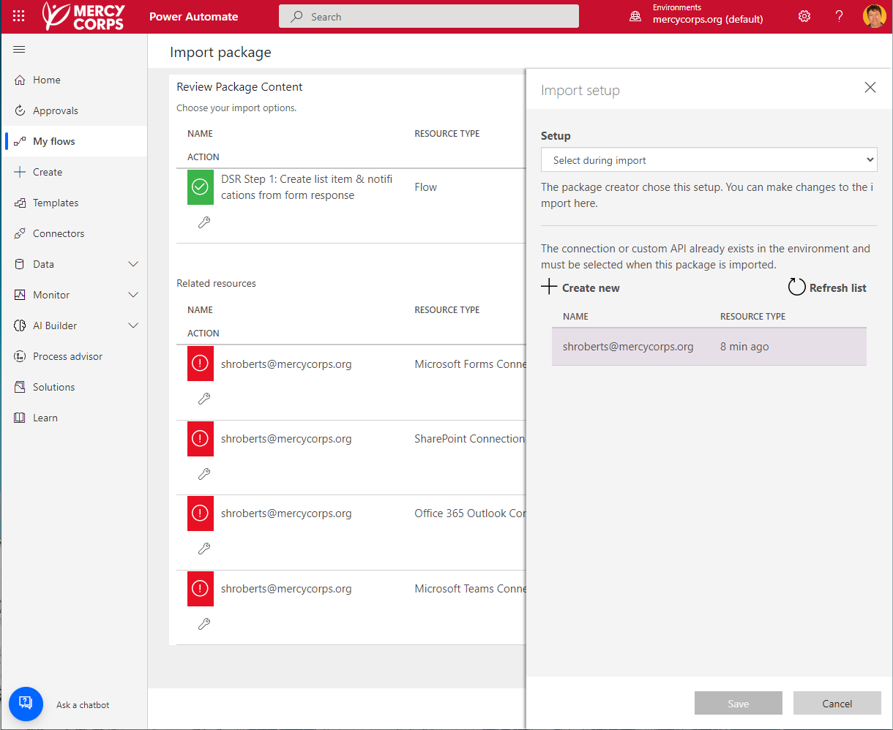

#  DSR Step 1: create list item & notifications from form responses

This is the first of two Power Automate Flows that are used by Mercy Corps' Data Protection and Privacy team (DPP) to handle data subject requests. This flow completes three actions when a data subject fills out our Data Subject Request form:
1. creates a new item in a SharePoint list using input data from a form (also updates the status of that item to `New`).
2. sends confirmation email to the data subject that form has been received and that DPP will follow-up.
3. Sends notification email and Teams chat message internally to flag the need to check the SharePoint list and update status of new item to `Approved` (which will trigger [the second flow](/Flow2-notify-list-item-changes-status/README.md)).

On it's own, this flow can be used to populate a list from form responses and send notifications. Together with the second flow in this repo, we can efficiently create data subject requests; send notifications to various system holders across our organization; and track the compliance of each system owner with the request. If we are audited, our flow provides detailed data concerning all actions taken to comply with the request. An overview of the assets used is below.

## Features
This flow uses the following concepts:

* Getting response details from a Microsoft Form.
* Creating a Sharepoint List item.
* Sending automated emails and Teams chats.

## Prerequisites
This flow requires a [Microsoft Form](https://support.microsoft.com/en-us/office/introduction-to-microsoft-forms-bb1dd261-260f-49aa-9af0-d3dddcea6d69) and a [List in SharePoint](https://support.microsoft.com/en-us/office/introduction-to-lists-0a1c3ace-def0-44af-b225-cfa8d92c52d7). You will need to map form fields to list columns. This example uses the following:
- **Form fields** - `Name`, `physical address`, `email`, `country of citizenship`, `request` (input as multiple options using radio buttons)
- **List fields (column headers)** - `Name`, `physical address`, `contact` (input as email), `Citizenship` (input as country), `request type` (input from `request` selection in form), `status` (items created with this flow are marked `New`), and various columns for systems that need to be checked for the request. This flow assumes two columns (labeled `System 1` and `System 2`), but you can add as many as you need.

Although built into this flow, it's helpful to remember that in order to pull information out of a form to be used in other actions you have to build a trigger for it: ([see MS help here](https://powerautomate.microsoft.com/en-us/blog/building-scratch-forms-responses/)).

## Installation
* [Download](Flow-file/DSR_Step1_Create_list_item_from_response.zip) the `.zip` file from the `Flow-file` folder by clicking on "View raw" or the "Download" button. <!-- Test download and import -->
* Browse to your [Power Automate](https://flow.microsoft.com/manage/environments) and select the environment where you wish to import the sample
* From the toolbar, select **Import**, then **Import package**.
* In the **Import package** page, select **Upload** and choose the `.zip` file containing the sample flow.
* You will need to change the relevant resources to connect with your account during the import. To do this, look for the `Select during import` link under the "Import Setup" column. Click this link, then look for your resources and connections to appear in the pop-up window. Select the appropriate resources then click save. See screenshot below.

> 

* Once you've updated the required resources select **Import**
* Once the sample Flow is installed, you'll still need to update all the parameters, fields, etc. to point to the Forms and Lists in _your_ Sharepoint site and update the assignees to individuals in your organization. These are detailed below.
* You may need to [turn the flow on](https://learn.microsoft.com/en-us/power-automate/disable-flow).

For further help importing Flows, [see this blog post from Microsoft](https://powerautomate.microsoft.com/en-us/blog/import-export-bap-packages/).

### Customization
Following the installation steps above will load this flow into your environment. However, you'll need to edit several sections to make it work. Listed below are the changes that need to be made for each action starting from the top of the flow.

#### Changes to "When a new response is submitted"
`Form ID` - this drop down list should populate with your forms. If you haven't created a form yet, it won't show up!

As an aside, I found figuring out exactly _where_ in my organization's Sharepoint to create the form a bit tricky. My original form didn't show up because it was a "group form", which I had to re-create in "my forms" - a barely perceptible link on the "group forms" page led me to this. I couldn't find a lot of documentation about the difference between these two types of forms, but [this thread in a community forum](https://answers.microsoft.com/en-us/msteams/forum/all/using-forms-with-teams-classroom-my-forms-vs-group/0f076ac4-a086-42df-b6f4-8eeb15a6a8b7#:~:text=Generally%2C%20a%20significate%20difference%20between%20Group%20Forms%20and,can%20edit%20and%20view%20the%20group%20forms%20created.) explains it.

#### Changes to "Get response details"
- `Form ID` - Same as above: select your form.
- `Response Id` - Use the dynamic content picker to replace this and ensure that the Id is coming from _your_ form.

#### Changes to "Create Item"
This is where new list items are created using the responses to the form.
- `Site Address` - Change to the SharePoint site that contains your list.
- `List Name` - Change to your list. The dropdown should automatically populate if `Site Address` is correctly configured.
- The remaining fields (e.g. `Name`, `Data Subject Physical address`, etc.) all come from the columns in your list. Use the dynamic content picker to select the values you need from **Get response details**: you are mapping the form fields to the column you want them to appear in. The values for the `Status Value` are pulled from the List itself. In this case, I want any new item to have a value of `New`.

#### Changes to "Send an email (V2)"
This is the generic template email that is sent to the data subject.
- `To` - Use the dynamic content picker to set the value for this to whatever field in your form contains the email address of the data subject.
- `Subject` - Keep or change to whatever you want to the subject line of the email to be.
- `Body` - You can configure the email however you need it. In this flow, I'm using the first and last name fields from the form to automatically create the opening line, then the rest is just static text.

#### Changes to "Send an email (V2)2"
This is the email that will go to the owner of the data subject request process.
- `To` - Change to whoever is the DSR owner in your organization.
- `Subject` - Keep or change to whatever you want to the subject line of the email to be.
- `Body` - You can configure the email however you need it. In this flow, I'm using the first and last name fields from the form to display who the request is from. I've also included a link to the list.

#### Changes to "Post message in a chat or channel"
Because I keep Teams open all day (and sometimes ignore email) I wanted to get a Teams notificaiton as well.
- `Post as` - You can configure this to post to a channel as you, but I prefer to be clear that it's a bot doing the sending.
- `Post in` - Again, you can set whatever channel you like, such as a group chat of folks handling DSR requests, but I keep it in single channel between me and the bot.
- `recipient` - Whoever the DSR owner is in your organization.
- `Message` - same as the `Body` field in the email: configure this to display whatever information you want to see.

## Help & Feedback
This repository is maintained by the Data Protection & Privacy team at Mercy Corps. If you are a Mercy Corps staff member and need help duplicating this flow for another use case, reach out to dataprotection@mercycorp.org for assistance. Anyone can [create a new issue](https://github.com/Shadrock/M365-flows/issues) for any problems and submit updates or additions to this material via a Github [pull request](https://docs.github.com/en/pull-requests/collaborating-with-pull-requests/proposing-changes-to-your-work-with-pull-requests/about-pull-requests).

## Disclaimer
This code is provided *as is* without any warranty of any kind, either express or implied, including any implied warranties of fitness for a particular purpose, merchantability, or non-infringement.
