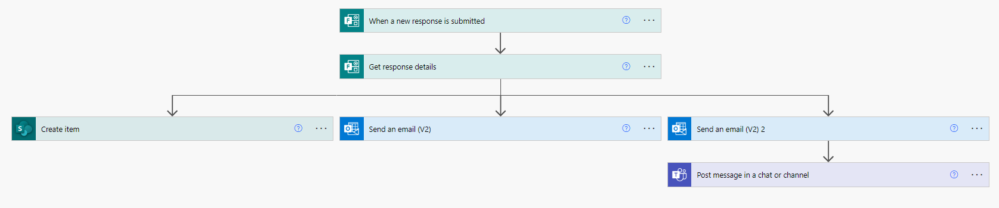

#  DSR Step 1: create list item & notifications from form responses

This is the first of two Power Automate Flows that are used by the Mercy Corps' Data Protection and Privacy team (DPP) to handle data subject requests. This flow completes three actions when a user fills out our Data Subject Request form:
1. creates a new item in a SharePoint list using input data from a form (also updates the status of that item to `New`).
2. sends confirmation email to the user that form has been filled out and that DPP will follow-up (using the `Send an email (V2)` action).
3. Sends notification email and Teams chat message internally to flag the need to check the SharePoint list and update status of new item to `In progress` (which will trigger the second flow) by using a second `Send an email (V2)` action in conjunction with a `Post message in a chat or channel` action.
<!-- Add link to DSR form once it's live -->
On it's own, it can be used to populate a list and send notifications. Together with the other flow in this repo, we can efficiently create data subject requests; send notifications to various system holders across our organization; and track the compliance of each system owner with the request. If we are audited, our flow provides detailed data concerning all actions taken to comply with the request.
<!-- Add link second flow once completed -->

## Features
This flow uses the following concepts:

* Getting response details from a Microsoft Form.
* Creating an item
* Sending an approval

## Prerequisites
This flow requires a [Microsoft Form](https://support.microsoft.com/en-us/office/introduction-to-microsoft-forms-bb1dd261-260f-49aa-9af0-d3dddcea6d69) and a [List in SharePoint](https://support.microsoft.com/en-us/office/introduction-to-lists-0a1c3ace-def0-44af-b225-cfa8d92c52d7). You will need to map form fields to list columns. This example uses the following:
- **Form fields** - Name, physical address, email, country of citizenship, request (input as multiple options using radio buttons)
- **List fields / column headers** - Name, physical address, contact (input as email), Citizenship (input as country), request type (input from selection in form), status (items created with this flow are marked `New`), and various columns for systems that need to be checked for the request. This flow in this repo assumes two columns (labeled "System 1" and "System 2"), but you can add as many as you need.

Although built into this flow, it's helpful to remember that in order to pull information out of a form to be used in other actions you have to build a trigger for it: ([see MS help here](https://powerautomate.microsoft.com/en-us/blog/building-scratch-forms-responses/)).

## Installation
* [Download](Flow-file/DSR_Step1_Create_list_item_from_response.zip) the `.zip` file from the `Flow-file` folder by clicking on "View raw" or the "Download" button. <!-- Test download and import -->
* Browse to your [Power Automate](https://flow.microsoft.com/manage/environments) and select the environment where you wish to import the flow.
* From the toolbar, select **Import**
* In the **Import package** page, select **Upload** and choose the `.zip` file containing the sample flow.
* Select **Import**
* Once the sample Flow is installed, you will need to change the relevant variables to connect with your forms, lists, and staff.

For further help importing Flows, [see this blog post from Microsoft](https://powerautomate.microsoft.com/en-us/blog/import-export-bap-packages/).

## Help & Feedback
If you are a Mercy Corps staff member and need help duplicating this flow for another use case, reach out to shroberts@mercycorps.org for assistance. <!-- add path when ready --> Anyone can [create a new issue](https://github.com/pnp/powerautomate-samples/issues/new?assignees=&labels=Needs%3A+Triage+%3Amag%3A%2Ctype%3Abug-suspected&template=bug-report.yml&sample=YOURSAMPLENAME&authors=@YOURGITHUBUSERNAME&title=YOURSAMPLENAME%20-%20) in this repository.

This repository is maintained by the Data Protection & Privacy team at Mercy Corps. You can submit updates or additions to this material via a Github pull request ([read about pull requests here](https://docs.github.com/en/pull-requests/collaborating-with-pull-requests/proposing-changes-to-your-work-with-pull-requests/about-pull-requests)) or by contacting us at dataprotection@mercycorp.org.

## For more information
- [Create your first flow](https://docs.microsoft.com/en-us/power-automate/getting-started#create-your-first-flow)
- [Microsoft Power Automate documentation](https://docs.microsoft.com/en-us/power-automate/)

## Disclaimer
This code is provided *as is* without any warranty of any kind, either express or implied, including any implied warranties of fitness for a particular purpose, merchantability, or non-infringement.
