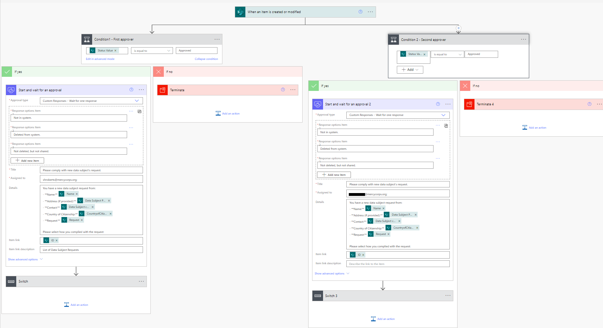
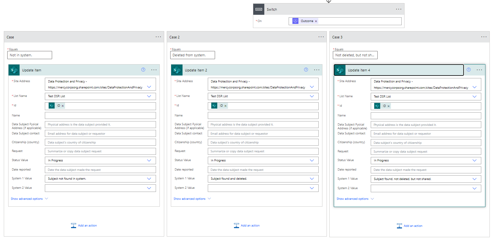
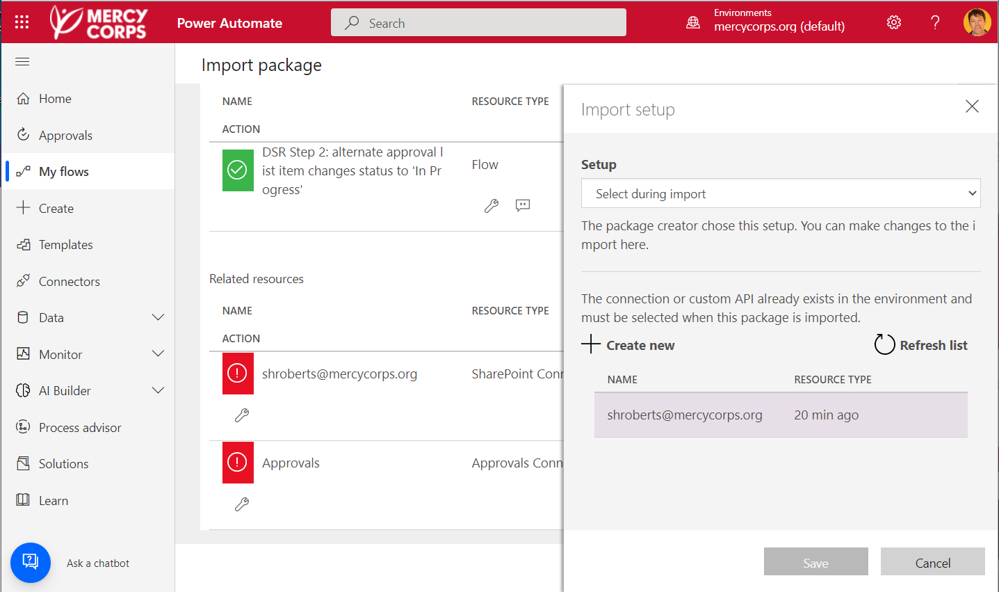

# DSR Step 2: approval action updates Sharepoint List item

This is the second of two Power Automate Flows that are used by the Mercy Corps' Data Protection and Privacy team (DPP) to handle data subject requests. This flow is triggered when the Data Subject Request form owner has reviewed a new request (generated by [DSR Step 1](/Flow1-create-list-item-notifications-form/README.md)) in the specified SharePoint list and changed the value of the **Status** column from `New` to `Approved`. This flow completes the following actions:

1. sends an approval via email to a specified system owner (currently hard-coded into the flow). The approval contains the data subject name, request, and three options for completing the request (which you could adjust or add as needed):
    - The data subject was not found in the system.
    - The data subject was found and deleted from the system.
    - The data subject was found in the system but was not deleted. This can be due to legal obligations to hold the data for a specified period of time, etc.
2. sends the same approval notification information via a Teams chat.

Once the system owner has selected the appropriate compliance option, the flow:

3. Updates the relevant Sharepoint list item **Status** field to `In progress`, which is needed to keep the flow from triggering repeatedly.
4. Updates the relevant Sharepoint list item with the compliance option selected by the system owner. This will appear in the column of the list assigned to that system owner.

An overview of the assets used is below.

In this flow, I'm using a "parallel branch" to add a second approver. To add more approvers you simply need to add a parallel branch for each one. Each parallel branch contains a **Start and wait for an approval** action in which the approval is configured. Under this, each branch also contains a **Switch case** containing an **Update Sharepoint list item** action. This connects the action taken by the approver (e.g. clicking "Subject not found in system") to the list item in Sharepoint (e.g. updates the appropriate column with "Subject not found in system"). I have one case for each option in the approval and, when expanded, the Switch cases look like this:

Together with the other flow in this repo this flow allows us to send approvals to various system holders across our organization and track the compliance of each system owner with the request. If we are audited, our flow provides detailed data concerning all actions taken to comply with the request.

## Features
This flow uses the following concepts:

* Modification of a SharePoint list item
* Conditions
* Sending approvals
* Parallel branches

## Prerequisites
This flow requires a [List in SharePoint](https://support.microsoft.com/en-us/office/introduction-to-lists-0a1c3ace-def0-44af-b225-cfa8d92c52d7). The list for this flow uses the following List fields/ column headers: `Name`, `physical address`, `contact`, `Citizenship`, `request type`, `status` (items created in the list using the first flow in this repo are marked `New`), and various columns for systems that need to be checked for the request. This flow in this repo assumes two columns (labeled `System 1` and `System 2`), but you can add as many as you need.

## Installation
* [Download](Flow-file/DSR_Step2_approval_list_item_status_update.zip) the `.zip` file from the `Flow-file` folder by clicking on "View raw" or the "Download" button. <!-- Test download and import -->
* Browse to your [Power Automate](https://flow.microsoft.com/manage/environments) and select the environment where you wish to import the sample
* From the toolbar, select **Import**, then **Import package**.
* In the **Import package** page, select **Upload** and choose the `.zip` file containing the sample flow.
* You will need to change the relevant resources to connect with your account during the import. To do this, look for the `Select during import` link under the "Import Setup" column. Click this link, then look for your resources and connections to appear in the pop-up window. Select the appropriate resources then click save. See screenshot below.

> 

* Once you've updated the required resources select **Import**
* Once the sample Flow is installed, you'll still need to update all the parameters, fields, etc. to point to the Forms and Lists in _your_ Sharepoint site and update the assignees to individuals in your organization. These are detailed below.
* You may need to [turn the flow on](https://learn.microsoft.com/en-us/power-automate/disable-flow).

For further help importing Flows, [see this blog post from Microsoft](https://powerautomate.microsoft.com/en-us/blog/import-export-bap-packages/).

### Customization
Following the installation steps above will load this flow into your environment. However, you'll need to edit several sections to make it work. Listed below are the changes that need to be made for each action starting from the top of the flow.

#### Changes to "When an item is created or modified"
- `Site Address` - change to the Sharepoint site that contains your list.
- `List Name` - change this to list you want to use. The drop-down menu should auto populate if your `Site Address` is properly configured.

#### Changes to "Condition 1 - First approver"
My list contains a column for "Status" with options for `New`, `Approved`, `In Progress`, and so on. If you're list is configured differently, you'll need to set the value you want to use here.

Under the **If yes** part of the condition you'll need to makes changes to **Start and wait for an approval**. I've set my approval to have 3 custom responses: `Not in system`, `Deleted from system`, and `Not deleted, but not shared`. Change these as needed. The rest of the approval can be customized as needed including the `Title` (or subject line of the approval); `Assigned to`, and the details of the approval. In this flow, I've "hard coded" the assignee: I've heard of people creating variables to hold individuals, but for this flow I'm just entering them in directly. Note that all of the `Details` in this approval reference specific fields in my Sharepoint list using the dynamic content picker. If you've configured your list as noted above in the prerequisites, you should be able to keep these the same: make sure that you refresh the `Item link` field with the ID for your list, however!

The next step in this flow is the **Switch**, which executes based on the action taken in the approval, such as clicking on `Not in system`. Each "Case" underneath the switch corresponds to one of the custom responses. So the `Equals` field for each case needs to match one of the responses from the approval. In the first Case, I'm setting up what will happen when a system owner clicks `Not in system.` in their approval.

Each Case also holds an **Update item** action. This is what will happen when a specific approval response is selected. Within each of these you'll need to make sure that, once again, the `Site Address`, `List Name`, and `Id` point to _your_ Sharepoint list! Each of the other fields corresponds to a column in the list I created. In this case, there is a column in the list for each system owner and it's in this column that I want to capture their approval response. There are only two updates I want made to the list: I want to the `Status value` to change to `In progress` and I want the response selected by the system owner to show up in the appropriate column. Because we are still working in the condition for the first approver, I have assigned the column `System 1 Value` and set the value for that as `Subject not found in system`. Again, the values you see here are all coming directly from my Sharepoint list: so be sure yours is set however you need it.

Go through Case 2 and Case 3 to make the same adjustments. All you are doing is connecting the action taken in the approval to the updates you want to see in the list. Once you've done this, move on to the next condition, "Condition 2 - Second approver". You will make almost all the same changes, with the exception that in all the cases, this approver should be assigned to a new column in your list. In this flow, I've set them to the column `System 2 Value`.

## Help & Feedback
This repository is maintained by the Data Protection & Privacy team at Mercy Corps. If you are a Mercy Corps staff member and need help duplicating this flow for another use case, reach out to dataprotection@mercycorp.org for assistance. Anyone can [create a new issue](https://github.com/pnp/powerautomate-samples/issues/new?assignees=&labels=Needs%3A+Triage+%3Amag%3A%2Ctype%3Abug-suspected&template=bug-report.yml&sample=YOURSAMPLENAME&authors=@YOURGITHUBUSERNAME&title=YOURSAMPLENAME%20-%20) for any problems and submit updates or additions to this material via a Github [pull request](https://docs.github.com/en/pull-requests/collaborating-with-pull-requests/proposing-changes-to-your-work-with-pull-requests/about-pull-requests).

### Resources
Although this flow comes packaged and ready to be imported, you may want to customize it. I found the following resources helpful when I was creating it.

- MS Docs has a good page on [Customizing Approval Requests](https://docs.microsoft.com/en-us/power-automate/approvals-howto), which includes a way to change the options/buttons in an Approval.
- As mentioned above, you can add more "[parallel branches](https://docs.microsoft.com/en-us/power-automate/parallel-modern-approvals)" to add more approvers.
- To understand Switch cases, [see MS documentation on conditionals here](https://learn.microsoft.com/en-us/power-automate/desktop-flows/use-conditionals).

## Disclaimer
This code is provided *as is* without any warranty of any kind, either express or implied, including any implied warranties of fitness for a particular purpose, merchantability, or non-infringement.
