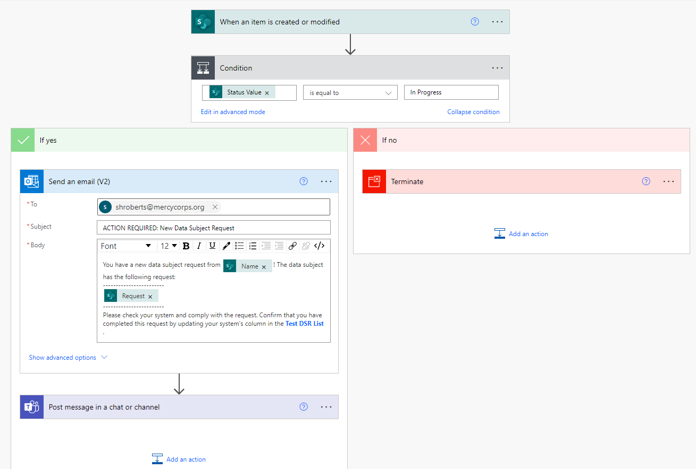

# DSR Step 2: notify when status of request is changed to 'In Progress'

## Summary
This is the second of two Power Automate Flows that are used by the Mercy Corps' Data Protection and Privacy team (DPP) to handle data subject requests. This flow completes two actions when the Data Subject Request form owner has reviewed a new request (generated by DSR Step 1) in the specified SharePoint list and changed the value of the **Status** column from `New` to `In Progress`:
1. sends notification email to specified address (system owner) with data subject name, request, and link to data subject request list with instructions to update, and
2. sends the same notification information via a Teams chat.

On it's own, it can be used to generate notifications when an element of a Sharepoint list is changed. Together with the other flow in this repo, we can efficiently create data subject requests; send notifications to various system holders across our organization; and track the compliance of each system owner with the request. If we are audited, our flow provides detailed data concerning all actions taken to comply with the request.

## Applies to
* [Microsoft Power Automate](https://docs.microsoft.com/power-automate/)
* Uses: Office 365 Outlook, Microsoft Teams, and SharePoint.

## Compatibility

<!-- Check this -->

## Authors
Solution|Author(s) , Organization
--------|---------
[Flow-file](Flow-file/) | [Shadrock Roberts](https://github.com/Shadrock), [Mercy Corps](https://www.mercycorps.org/)

## Version history
Version|Date|Comments
-------|----|--------
1.0|July XX, 2022|Initial release
<!-- Update on Release -->

## Features
This sample Flow illustrates the following concepts:

* Modification of a SharePoint list item
* Conditions
* Sending an email
* Posting a Teams message in a chat

## Prerequisites
This flow requires a [List in SharePoint](https://support.microsoft.com/en-us/office/introduction-to-lists-0a1c3ace-def0-44af-b225-cfa8d92c52d7). You will need to map form fields from the list  to the body of the notification (e.g. name of requestor). This example uses the following list fields to populate content in the notifications: `Name`, `Status`, and `request`.

## Installation
* [Download](Flow-file/notification-listitem-changes-status_20220713213708.zip) the `.zip` file from the `Flow-file` folder by clicking on "View raw" or the "Download" button. <!-- Test download and import -->
* Browse to your [Power Automate](https://flow.microsoft.com/manage/environments) and select the environment where you wish to import the sample
* From the toolbar, select **Import**
* In the **Import package** page, select **Upload** and choose the `.zip` file containing the sample flow.
* Select **Import**
* Once the sample Flow is installed, you will need to change the relevant variables to connect with your forms, lists, and staff.

For further help importing Flows, [see this blog post from Microsoft](https://powerautomate.microsoft.com/en-us/blog/import-export-bap-packages/).

### Changes / updates
??? Do we need further instructions here ???

## Disclaimer
This code is provided *as is* without any warranty of any kind, either express or implied, including any implied warranties of fitness for a particular purpose, merchantability, or non-infringement.

??? Would it be better to simply have a CC licence, which would take care of all this ??? I think so!

## Help & Feedback

If you are a Mercy Corps staff member and need help duplicating this flow for another use case, reach out to WHO@mercycorps.org for assistance. <!-- add path when ready --> Anyone can [create a new issue](https://github.com/pnp/powerautomate-samples/issues/new?assignees=&labels=Needs%3A+Triage+%3Amag%3A%2Ctype%3Abug-suspected&template=bug-report.yml&sample=YOURSAMPLENAME&authors=@YOURGITHUBUSERNAME&title=YOURSAMPLENAME%20-%20) in this repository.

This repository is maintained by the Data Protection & Privacy team at Mercy Corps. You can submit updates or additions to this material via a Github pull request ([read about pull requests here](https://docs.github.com/en/pull-requests/collaborating-with-pull-requests/proposing-changes-to-your-work-with-pull-requests/about-pull-requests)) or by contacting us at dataprotection@mercycorp.org.

## For more information
- [Create your first flow](https://docs.microsoft.com/en-us/power-automate/getting-started#create-your-first-flow)
- [Microsoft Power Automate documentation](https://docs.microsoft.com/en-us/power-automate/)
