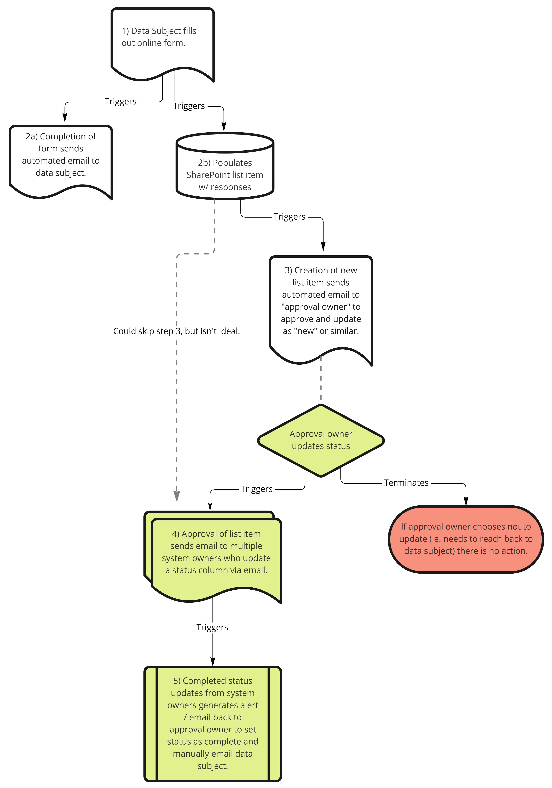

# Request approval for new item in a SharePoint list (send item to multiple people for status updates)

## Summary
This flow:
1. Generates a new SharePoint list item from a public form for data subjects.
2. Sends approver owner an email to review the new item (and manually mark as "new" or "in progress" or some variant thereof).
3. _Either_
	1. Approval from #2 triggers a review/status update from system owners who can update status via email -_or_-
	2. New item creation skips #2 goes straight to multiple approvers (**although this doesn't sound like the best option**)
4. Once all status columns for list item are updated (completed?) an alert/email is generated to approval owner so they can update item status to "complete" or similar and send confirmation of action to the data subject. 

## The Flow
I am envisioning a flow like: 

## Notes
It's possible that this flow would actually be two separate flows: one to generate the list item from a form and send out email to approval owner, then a _second_ flow that triggered once the approval owner "approved" or changed status on the list item and took it through the rest of the steps. Not sure if it's easier/better to do one flow versus two. 

## Resources:
- MC staff can access [the Miro board of flow here](https://miro.com/app/board/uXjVOp0icsQ=/?share_link_id=343465265876). 
- See [this sample from from the M365 user community](https://github.com/pnp/powerautomate-samples/tree/main/samples/request-review-and-approval-for-a-selected-file)
- See also [this Power Automate template from Microsoft](https://powerautomate.microsoft.com/en-us/templates/details/d62b2527bb5343d689d5107b0922e57b/start-approval-when-a-new-item-is-added/) or,
- the [larger library of Power Automate templates](https://powerautomate.microsoft.com/en-us/templates/) 
