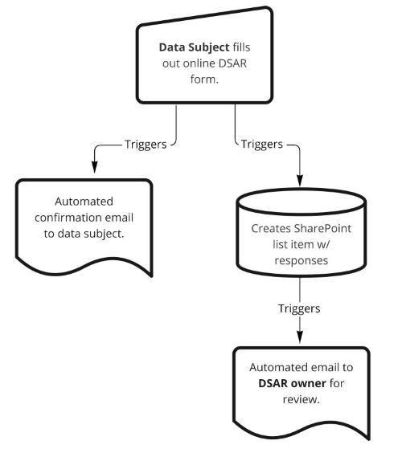
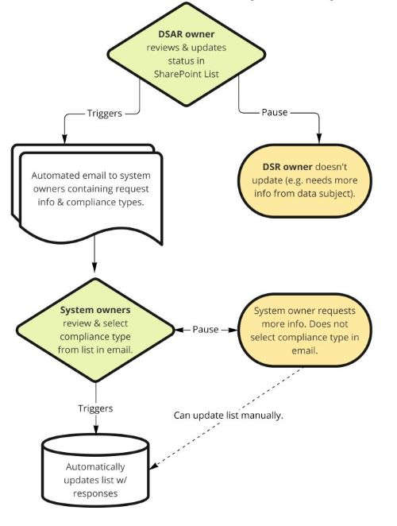

# A Lightweight Data Subject Request Tracker

This repository contains files and general instructions for creating a basic Data Subject Request tracker using Microsoft Power Automate. Some familiarity with various aspects of Microsoft (MS) Sharepoint - specifically [Forms](https://support.microsoft.com/en-us/office/create-a-form-with-microsoft-forms-4ffb64cc-7d5d-402f-b82e-b1d49418fd9d), [Lists](https://support.microsoft.com/en-us/office/introduction-to-lists-0a1c3ace-def0-44af-b225-cfa8d92c52d7), and [Approvals](https://support.microsoft.com/en-us/office/what-is-approvals-a9a01c95-e0bf-4d20-9ada-f7be3fc283d3) - will be extremely helpful for replication.

## Use Case
A Data Subject Request (or Data Subject Access Request) are required by various privacy laws, and allow an individuals to access information about personal data the organization is processing about them, generally for the purposes of understanding what data are held, updating data, or asking the organization to delete their data. At Mercy Corps, such a request requires coordinating with the owners of 11 different information systems and my team needed a relatively easy way to track these requests.

The initial "system" that was developed for these was simply to receive a request via an email, then email all the system owners at regular intervals to comply with the request. There were several problems with this and the system was:
- unresponsive to data subjects who didn't get an immediate response;
- inefficient: clogged inboxes, searching for emails, etc;
- difficult to track and hard to see who has complied with what;
- difficult to report on, since any audit trail would require searching through and stitching together multiple emails;
- insecure because emails containing personal information related could stay in people’s inboxes.

## Summary
The solution presented here uses a Form, a List, and Power Automate to create a more secure, more efficient system based on a two part workflow.

### Part 1 - Automated Request Creation
The first flow takes input from a form and creates a new item in a Sharepoint list, which in turn notifies the "DSAR owner" (person responsible for complying with the request) that a new item has been created. The flow also sends an automated email to the requestor informing that the request has been received.

In the flow I've created, the DSAR owner manually reviews the request and then continues the flow by updating the request. This step could also be part of the flow, but it was easiest for me to simply review the list manually and update each item at regular intervals.

### Part 2 - Semi-Automated Request Compliance
Upon reviewing the request and deciding to proceed, the DSAR owner updates the status of the list item from `New` to `Approved`, which triggers an approval to multiple system owners. The approval I've created allows for 3 types of response:
- The data subject was not found in the system.
- The data subject was found and deleted from the system.
- The data subject was found in the system but was not deleted. This can be due to legal obligations to the hold the data for a specified period of time, etc.

You can create whatever response types you need.

A system owner can simply click the appropriate response type, add a comment, and submit. This automatically updates the list item with whatever response was taken. The DSAR owner can track the status of all requests across all systems and the actions of each system owners are captured in the Microsoft Approvals history in case an audit trail is required. The fact that approvals transform once completed means that no personal information remains inadvertently inside of emails and membership to lists can be easily managed to limit access to only those who need it.

### Future Improvements - to write
What would I change?
Make all one flow.
Automatic email to requestor based on column status?

## Requirements - to write... or should this just separate readme for each flow? 
Form - what fields?
List - what columns?
People - who owns what?

## Acknowledgements / Resources
I found the following extremely helpful for developing my flow:

- This walk-through for creating a [Simple Ticketing System in SharePoint Online](https://concurrency.com/blog/february-2019/create-a-simple-ticketing-system-in-sharepoint-onl) is what got me started thinking about managing DSRs in a List versus the current spreadsheet workflow.
- This sample [request/review/approval flow from the the M365 user community](https://github.com/pnp/powerautomate-samples/tree/main/samples/request-review-and-approval-for-a-selected-file)
- A [Power Automate template from Microsoft](https://powerautomate.microsoft.com/en-us/templates/details/d62b2527bb5343d689d5107b0922e57b/start-approval-when-a-new-item-is-added/) or the [larger library of Power Automate templates](https://powerautomate.microsoft.com/en-us/templates/)
- Documentation from Microsoft outlining [parallel approvals](https://docs.microsoft.com/en-us/power-automate/parallel-modern-approvals#insert-a-parallel-branch-approval-action-for-the-sales-team) and how to [package Power Automate flows](https://powerautomate.microsoft.com/en-us/blog/import-export-bap-packages/) for sharing, import, and export.
