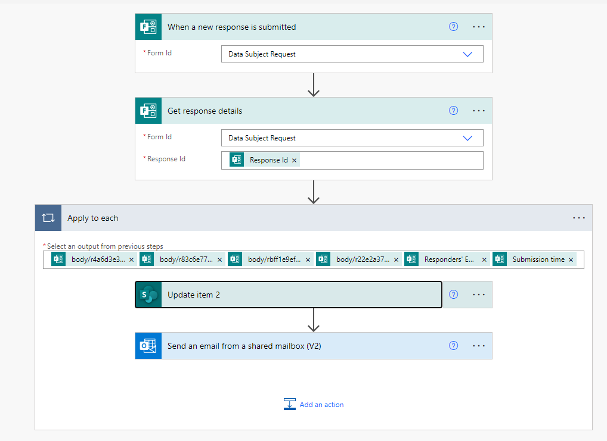

# Request approval for new item in a SharePoint list (send item to multiple people for status updates)
[See use case and flow structure in the `README` for this repo here](https://github.com/Shadrock/M365-flows)

## Tutorial
[Following this tutorial](https://docs.microsoft.com/en-us/learn/modules/get-started-flows/)

**FAQ**
Where can I create and administer a flow? Via browser at https://us.flow.microsoft.com/ unless you have the mobile app on your phone (sounds terrible)

## Notes

Nice to realize you can access templates in browser: in the left-hand nav column.
All flows start with Triggers.
To change the "dynamic content" that Flow loads from previous actions, delete the "tag" looking icon and place your cursor in the empty space. Flow will prompt with what's able to pull in given the source/actions.

Always run "Flow checker" before saving. As I've started to play around with changing dynamic content in certain actions I've also started breaking things. I'm saving out of habit, then getting prompted with flow checker to fix what I broke! Much easier to run Flow Checker in advance!

I'm using the `Start an approval in Teams when a SharePoint list is modified` template and, weirdly, it doesn't seem to send any notice when an item is _deleted_.

I still can't figure out how to change the "approval" action to an "update status" action. I'd like to be prompted to just update the status column with the values it holds. It may not be possible to repurpose the "approval" action to do this. I may need a whole new action.

**Actions from Forms**

I've created a form from via browser from my MC Sharepoint ([form lives here on my Sharepoint]([https://www.office.com/launch/forms?auth=2](https://forms.office.com/Pages/DesignPageV2.aspx?origin=OfficeDotCom&lang=en-US)) | [see the form here](https://forms.office.com/Pages/ResponsePage.aspx?id=KIbeCD5Z9UOc6_Pl3XriywVfhv4T9KhOsEwFoQU42DdUM0ZJRjQzTjRDWTdTNVM1Vk4wUzlZSjRWNy4u) )

**Lessons Learned:**

In order to pull information out of a form to be used in other actions you have to build a trigger for it ([see MS help here](https://powerautomate.microsoft.com/en-us/blog/building-scratch-forms-responses/)). This involves selecting **New step**  >  **Add an action** and then search for **Microsoft Forms**. You will see the action **Get response details**. On this action, you'll need to select the same **Form Id** that you used in the trigger (I copied/pasted the same `id`). Then, click in the **Response Id** text box, you'll see the **Dynamic content** menu pop up, in which you'll have one option: **Response Id**. Select this option — this means that you'll get the response details for the responses that caused the trigger. There can be more than one response at the same time, so the **Response Id** actually represents a list of responses. As a result, when you select this input you'll get an **Apply to each** added around this action.

From there, you can select outputs from the various fields (responses) from the form.

Another trick is that once you've gotten the response details, _any_ action that will used them needs to be nested within an action called **Apply to each**. The blog post suggests this gets created automatically, but I actually just added it manually. The use-case here is that I want to create a row in a SharePoint list using the form data, but I also want to send the person filling out the form a canned response, using the email they submitted in the form.

So the current flow looks like this:

## Troubleshooting
To debug flows go to **Monitor** and then **Cloud flow activity** on the left menu (or select the **Activity** tab in the mobile app) and then select your flow in the list that appears. This is vastly more helpful than the pointless "PowerBI check thingy" and shows exactly where the flow broke by displaying green check icons on steps that worked and a red exclamation point (!) symbol on the ones that didn't.

However, it seems to take this service a _while_ to update. Feels like from 10-15 minutes...

## Problems

~~I suspect that my Flow isn't finding my form. It's not coming up in the list, but I'm seeing obvious test forms such as `Michael Boeglin wants:`, `Should we do a poll?`, etc. I looked for these polls in our SharePoint to see if I could move my poll to wherever they were being pulled from, but couldn't find them.~~ I then found [this thread on providing Flow with an ID](KIbeCD5Z9UOc6_Pl3Xriyx3n5LHDRGZKthkEGSwyKjpUNVdVUlA4RkE5NTBRQ1dSTU1JQllMNEo5NiQlQCN0PWcu). This involves looking at the form as a user (not just copying a share link, but actually activating that link yourself), then looking at the URL to find the `id`, which should be everything _after_ `FlowID=`. However, it looks like the URL structure has changed to be simpley `id=`. So from the URL `https://forms.office.com/Pages/ResponsePage.aspx?id=KIbeCD5Z9UOc6_Pl3Xriyx3n5LHDRGZKthkEGSwyKjpUNVdVUlA4RkE5NTBRQ1dSTU1JQllMNEo5NiQlQCN0PWcu` we would grab `KIbeCD5Z9UOc6_Pl3Xriyx3n5LHDRGZKthkEGSwyKjpUNVdVUlA4RkE5NTBRQ1dSTU1JQllMNEo5NiQlQCN0PWcu` as the ID.
- ~~**I don't think this is working.** Next step is to check the connections for the form. It looks like it's running from my MC account... but should it be running from DPP Sharepoint? You'll need to "manage connections" for this.~~
 - I checked this. For reference, the above trick using `id` definitely didn't work. I deleted the form, which I had created in the... ["general?" DPP Sharepoint space](https://www.office.com/launch/forms/groupforms?auth=2&groupId=b1e4e71d-44c3-4a66-b619-04192c322a3a) and which was a "Group form" and re-created it in "My forms" - a barely perceptible link on the "group forms" page led the way. It now shows up under the dropdown menu for flows, which is great. However the flow is STILL FAILING!!! It's not populating the list nor generating an email.

 ### Changes 7/5
Got rid of the **Apply to each** container. Then ran. List populated! My flow to alert for new list item still works.  

----

However, the Email failed and the error was `Group Shard is used in non-Groups URI.`
so, I Changed action from `Send an email from a shared mailbox (V2)` to `Send an email (V2)` and set the `From (Send as)` field with the dataprotection@ mailbox.

------
Now I'm getting the email, but the list is failing!

Error code: `Could not find list item. clientRequestId: 84c0ebbd-2102-49f1-aed2-3f35a7e9fff0 serviceRequestId: 84c0ebbd-2102-49f1-aed2-3f35a7e9fff0`

This one is really stumping me... notification email regularly works... list regularly fails. I've re-done the action a few times to try and "reset" the connection to the SharePoint list, which always shows up okay. Check to see if:
- [x] I need to change the input from the DPP SP that doesn't show spaces to the one that shows them as `%` symbols?
	- Just threw and error when I tried this and didn't list any associated content.
- [ ] I should change the `Update item` action back to `Update item 2` (what's the difference here?)
- [ ] they _really should be_ in the **Apply to each** container?

Remember: read the code! The prompt for the `Id` field in Update item is "Unique identifier of item to be updated"... I'm using the Response ID from the Get Response details action! I started using the information icon to look up what different actions do and am now trying **Create item**, which is to add an item to a list. This _does not_ have an `Id` field! However, it's a bit confusing because when you get the "Dynamic content" pop up you have to scroll all the way down to see the option to get input fields from the form!

FARKHING SUCCESS!
