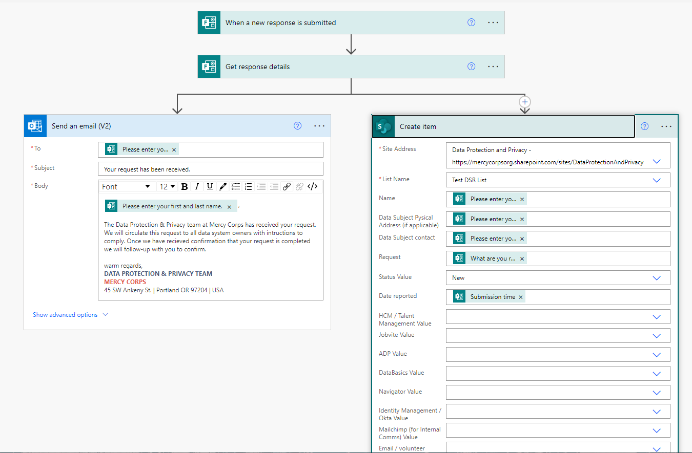
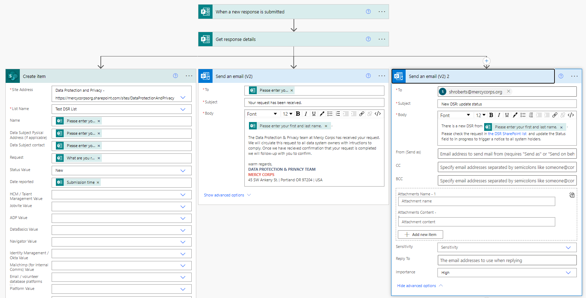
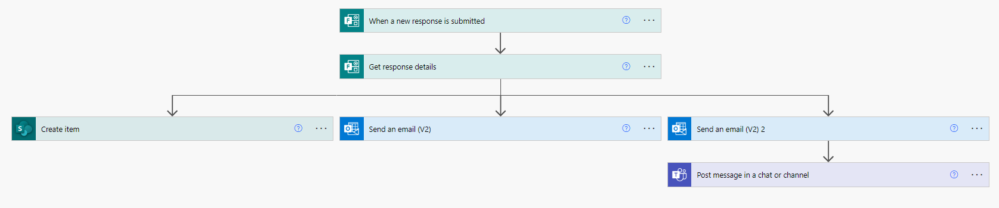
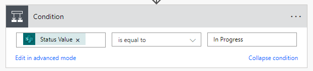
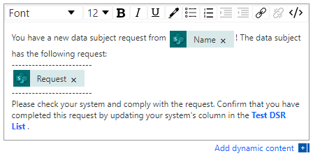
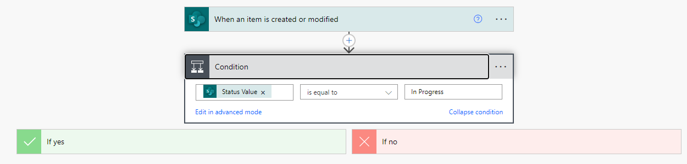
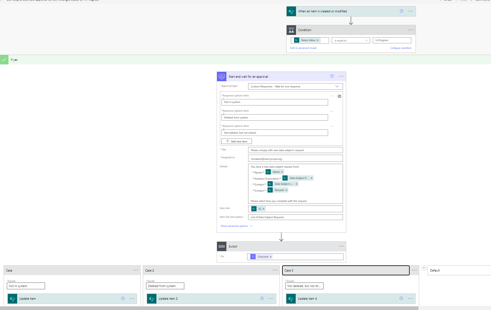

# Request approval for new item in a SharePoint list (send item to multiple people for status updates)
[See use case and flow structure in the `README` for this repo here](https://github.com/Shadrock/M365-flows). I'm following a few different tutorials here to work on a few different flows.

## Tutorial
[Following this tutorial](https://docs.microsoft.com/en-us/learn/modules/get-started-flows/)

**FAQ**

- Where can I create and administer a flow? A: Via browser at https://us.flow.microsoft.com/ unless you have the mobile app on your phone (sounds terrible)
- Which SharePoint list is being used? A: [This one](https://mercycorpsorg.sharepoint.com/sites/DataProtectionAndPrivacy/Lists/Test%20DSR%20List/AllItems.aspx?as=json) (on DPP SharePoint).
- Where did the form come from? A: I've created a form via browser from my MC Sharepoint ([form lives here on my Sharepoint](https://forms.office.com/Pages/DesignPageV2.aspx?origin=OfficeDotCom&lang=en-US)) | [see the form here](https://forms.office.com/Pages/ResponsePage.aspx?id=KIbeCD5Z9UOc6_Pl3XriywVfhv4T9KhOsEwFoQU42DdUM0ZJRjQzTjRDWTdTNVM1Vk4wUzlZSjRWNy4u)

**Troubleshooting**

I started running "Flow checker" before saving to see if I'd broken anything but, honestly, it never showed any errors. Those only showed up on run. So, now I generally run the flow then, to debug them go to **Monitor** and then **Cloud flow activity** on the left menu (or select the **Activity** tab in the mobile app) and then select your flow in the list that appears. This is vastly more helpful than the Flow checker (or this other pointless "PowerBI check thingy" that I ran once, which also showed that everything was fine) and shows exactly where the flow broke by displaying green check icons on steps that worked and a red exclamation point (!) symbol on the ones that didn't. However, it seems to take this service a _while_ to update after you run a flow. Feels like from 10-15 minutes... so be patient.

## Notes - Getting started & Actions from Forms
Nice to realize you can access templates in browser: in the left-hand nav column.
All flows start with Triggers.
To change the "dynamic content" that Flow loads from previous actions, delete the "tag" looking icon and place your cursor in the empty space. Flow will prompt with what's able to pull in given the source/actions.

I'm using the `Start an approval in Teams when a SharePoint list is modified` template and, weirdly, it doesn't seem to send any notice when an item is _deleted_.

I still can't figure out how to change the "approval" action to an "update status" action. I'd like to be prompted to just update the status column with the values it holds. It may not be possible to repurpose the "approval" action to do this. I may need a whole new action. (Figured out how to change one status... but the ability to do this for multiple choice on the part of 11 system owners will be tricky)

**Lessons Learned:**
In order to pull information out of a form to be used in other actions you have to build a trigger for it ([see MS help here](https://powerautomate.microsoft.com/en-us/blog/building-scratch-forms-responses/)). This involves selecting **New step**  >  **Add an action** and then search for **Microsoft Forms**. You will see the action **Get response details**. On this action, you'll need to select the same **Form Id** that you used in the trigger (I copied/pasted the same `id`). Then, click in the **Response Id** text box, you'll see the **Dynamic content** menu pop up, in which you'll have one option: **Response Id**. Select this option — this means that you'll get the response details for the responses that caused the trigger. There can be more than one response at the same time, so the **Response Id** actually represents a list of responses. As a result, when you select this input you'll get an **Apply to each** added around this action. From there, you can select outputs from the various fields (responses) from the form.

Another trick is that once you've gotten the response details, multiple actions that will used them _may_ need to be nested within an action called **Apply to each**. The blog post suggests this gets created automatically, but I actually just added it manually. The use-case here is that I want to create a row in a SharePoint list using the form data, but I also want to send the person filling out the form a canned response, using the email they submitted in the form. After going through all this I had the following flow, which didn't work!

So I got rid of the **Apply to each** container and, instead, just created a "parallel branch" which means two actions run. The list populated (yeah!), my flow to alert for new list item still worked, but the email response to the form submitter failed. The error was `Group Shard is used in non-Groups URI.` The fix for this is to not use the **Send an email from a shared mailbox (V2)** action and, instead, use the **Send an email (V2)** action and set the `From (Send as)` field with the shared mailbox you want to use (in this case dataprotection@).

This worked, but then the list in Sharpoint didn't update. Error code: `Could not find list item. clientRequestId: 84c0ebbd-2102-49f1-aed2-3f35a7e9fff0 serviceRequestId: 84c0ebbd-2102-49f1-aed2-3f35a7e9fff0` This one is stumped me. I re-did the action a few times to try and "reset" the connection to the SharePoint list, which always shows up okay. I checked to see if I needd to change the input from the DPP SP that doesn't show spaces to the one that shows them as `%` symbols, but that just threw and error when I tried and didn't list any associated content.

Then I slowed down and really read the code! The prompt for the `Id` field in the **Update item** action is "Unique identifier of item to be updated"... I was using the `Response ID` from the **Get Response details** action because this was left over from using the **Apply to each** action! I wasn't using the ide of the item to be updated, but of the item that the updated info should come from. I started using the information icon to look up what different actions do and changed the action to **Create item**, which is to add an item to a list. This _does not_ have an `Id` field! However, it's a bit confusing because when you get the "Dynamic content" pop up you have to scroll all the way down to see the option to get input fields from the form.

SUCCESS! Woot woot.

## Notes - Approval flow & Infinite Loops
Just like in coding, you have to watch out for infinite loops. I'm updating my approval flow to change the status of an item in the list from `New`, which is set when the create new item flow is triggered from the form, to `In progress` when I click "approve". However, the initial trigger runs when a list is modified, which my approval would do. So I have to be sure to enter[ a trigger condition](https://powerusers.microsoft.com/t5/Power-Automate-Community-Blog/Power-Automate-Trigger-Conditions-made-EASY/ba-p/441348) in the initial trigger to give it bound on when to run. In this case, I want to say, "only run if status = `New`" or, conversely "Don't run if status is something other than `New`". Figuring this out took a bit and there a [guide with lots of examples of trigger conditions here](https://www.spguides.com/power-automate-trigger-conditions/).

For this, I've added the following expression to the **When a new response is submitted** action, by clicking the horizontal ellipsis / meatballs icon and adding this to the Trigger conditions section: `@equals(triggerBody()?['Status'], 'New')`. This will trigger only when the Status of an item in the list is `New`. So when my approval changes it to `In progress` it won't keep looping.

So I did that... and it broke the damn flow. Actually, I don't see any sign that it triggered at all, so I'm assuming it's the trigger condition. Either the flow breaks because of something else, or setting the trigger condition to status as `New` creates a problem... not sure how though, unless the creation of the new item is registered as new _after_ the flow picks it up. could I make it not equal `In progress`, along with the others?

**Note** - I'm realizing that this is the wrong kind of flow. I do _not_ want an approval anytime the list is updated. I just want to know when a new entry is there, which I will check, and then update. I think I need to get rid of the approval flow and just get second email sent to me upon item creation so I can update. Then the update triggers the system owner email: this will be a lot easy to govern since it's just one action (`Status` = `In progress`) that will be a trigger.
- Added an **Apply to each** container to the Create List Item flow. Put the Send an email (V2) within that and added an additional one set to simply notify my that the record has been created and that I need to update status. - This didn't work!
- I just kept it simple: added yet another parallel branch (I now have 3 coming from the action) that sends a different email to me. Works just fine!!!

So, complete Flow #1 (or first flow), looks like this:

### Next steps for Flow #1
- [ ] Decide whether or not the parallel branches should be contained with an **Apply to each** container. Would that be more clean?
- [X] Add a Teams notification along w/ email notification to me. This was easy: just added a next step under the email.
Updated complete Flow #1 (or first flow), looks like this:

## Notes - Getting started on Flow #2
I was able to fairly easily set up notifications that are triggered on the condition of an item being modified [using this post](https://powerusers.microsoft.com/t5/Using-Flows/Status-changes-email-notification-flow/td-p/110122).

One slightly tricky bit in the condition was ensuring that I had selected that the `Status Value` `is equal to` as opposed to just `Status` is equal to. Also, wasn't quite sure how to get the list of values for the Status column so after `is equal to`, I simply typed it in: `In Progress`. This worked! As a check, I selected the "Edit in advanced mode" link under the condition to see what the formula looked like: `@equals(triggerBody()?['field_4']?['Value'], 'In Progress')`. See screenshot below.

The other tricky thing was formatting the body of the notifications. I just guessed that - since the Flow started / triggered with a SharePoint list item that the values from that would automatically populate in the "Dynamic Content" window and they did. So I was able to pull data subject name and request. However, just plopping in the value (using the Dynamic Content icon) was tricky because you can't apply styling to that. There may be a way to add this but treating the icon as text in the WYSIWYG didn't work. Neither did Markdown formatting for the Teams chat. I tried using the code block formatting (e.g. `this`) but it just showed the **`** right along with the text. In the end I went with:

The current flow is:

I don't know if I need to, but I've added a termination command to the "if no" branch.

Final step is figuring out if I can allow column-level status changes via email or Teams!!!

### Flow #2 Part Deux
Big breakthrough here! The flow works and currently looks like this:

The key seems to be using the **Start and wait for an approval** action versus the **Create an approval action**. I've set the approval type for `Custom Responses - Wait for one response`, wihch is working well for just me: we'll see how this works for multiple people! After this action, you use a **Switch** action and set it's "On" varaiable to `Outcome` (this should be dynamically available). From there you set up "Cases" in which the response the approver choose triggers a further action, in this case I'm using **Update Item** to change the status of the appropriate column in the list.

Just figured out why the list triggers twice: the flow is set to trigger value is `In Progress`, which it does. However, this doesn't change after the system owner updates their system column with their compliance response... so I need some way to change that. Could add another variable to status column (e.g. `approved` that changes to something like `in progress` when the first system owner responds...). Needs some thought. 

I got to this point following the [Introducing Custom Response Options for Approvals](https://powerautomate.microsoft.com/en-us/blog/introducing-custom-response-options-for-approvals/) blog post from MS. This, [Add information to approval response and update sharepoint item](https://powerusers.microsoft.com/t5/Building-Flows/Add-information-to-approval-response-and-update-sharepoint-item/m-p/275080#M28225) post on the community forum was also helpful.

Community post on [Multiple approvals based on different columns](https://powerusers.microsoft.com/t5/Building-Flows/Multiple-approvals-based-on-different-columns/m-p/1366790#M154292) looks very useful for multiple approvals in which each approval is for a different column. This [community post about multiple approvers](https://powerusers.microsoft.com/t5/Building-Flows/Multiple-approvers-workflow/m-p/185644#M19109) may also be helpful. 

## List Changes
I was looking up ways to modify list values and ran across [this post](https://techcommunity.microsoft.com/t5/sharepoint/updating-specific-list-column-value-with-flow/m-p/757183), which had a useful piece of information in it:
> Also, if you set the default view of the list to be filtered so people can only see the items where the <shift person> column equals [Me], they can just pull up the list, see their own record and edit it. That will greatly reduce the probability of Mark accidentally editing the item for Jane. You can also turn on versioning, so each and every item change can be traced back to who made the change.

I definitely want to change the DSR list view so the system owners only see their column! [This MS post on SharePoint list security](https://docs.microsoft.com/en-us/answers/questions/557017/sharepoint-list-security.html) may be useful for this.

**Gah... looks like views cannot be created at the column/field level: only the `item` level, which equates to a row or "record".**

Also...

>  If versioning is turned on,  there is an audit trail that shows exactly when a change was made [to the list], and by whom.

This is what I'm looking for in terms of audit capacity. I did turn versioning on [following this documentation from MS](https://support.microsoft.com/en-us/office/how-versioning-works-in-lists-and-libraries-0f6cd105-974f-44a4-aadb-43ac5bdfd247). Still not quite sure how I'd run it in an audit, but it _is_ showing up.

#### To Do List for List
 - [ ] **Need to make status same in list as in flow** (e.g. "Not in system" for both)
 - [X] I need to add a field for country in the list that maps to the form! Done for DSR test list.
 - [ ] ~~Change the DSR list view so the system owners only see their column!~~ Not possible at column level. 
 - [ ] Confirm audit trail: either use versioning in list as noted above or see if approver Id can go into comments with some metadata.

### Notes on Problems I've run into - may or may not make it into documentation

~~I suspect that my Flow isn't finding my form. It's not coming up in the list, but I'm seeing obvious test forms such as `Michael Boeglin wants:`, `Should we do a poll?`, etc. I looked for these polls in our SharePoint to see if I could move my poll to wherever they were being pulled from, but couldn't find them.~~ I then found [this thread on providing Flow with an ID](KIbeCD5Z9UOc6_Pl3Xriyx3n5LHDRGZKthkEGSwyKjpUNVdVUlA4RkE5NTBRQ1dSTU1JQllMNEo5NiQlQCN0PWcu). This involves looking at the form as a user (not just copying a share link, but actually activating that link yourself), then looking at the URL to find the `id`, which should be everything _after_ `FlowID=`. However, it looks like the URL structure has changed to be simpley `id=`. So from the URL `https://forms.office.com/Pages/ResponsePage.aspx?id=KIbeCD5Z9UOc6_Pl3Xriyx3n5LHDRGZKthkEGSwyKjpUNVdVUlA4RkE5NTBRQ1dSTU1JQllMNEo5NiQlQCN0PWcu` we would grab `KIbeCD5Z9UOc6_Pl3Xriyx3n5LHDRGZKthkEGSwyKjpUNVdVUlA4RkE5NTBRQ1dSTU1JQllMNEo5NiQlQCN0PWcu` as the ID.
- ~~**I don't think this is working.** Next step is to check the connections for the form. It looks like it's running from my MC account... but should it be running from DPP Sharepoint? You'll need to "manage connections" for this.~~
 - I checked this. For reference, the above trick using `id` definitely didn't work. I deleted the form, which I had created in the... ["general?" DPP Sharepoint space](https://www.office.com/launch/forms/groupforms?auth=2&groupId=b1e4e71d-44c3-4a66-b619-04192c322a3a) and which was a "Group form" and re-created it in "My forms" - a barely perceptible link on the "group forms" page led the way. It now shows up under the dropdown menu for flows, which is great. However the flow is STILL FAILING!!! It's not populating the list nor generating an email.

## Next steps
- [x] I need some way to notify system owners that a new record and has been created...
- [x] and allow them to update the status via email. Is this possible?
  - I've created a draft second flow that triggers when I change the **Status** column from `New` to `In Progress` and sends an email/Teams chat with the data subject's name and request and link to list for system owner to update. next step is to see if they can update via mail (like an approval) as opposed to having to go to the list.
  - Looks like this is possible with either [`Set content approval status`](https://docs.microsoft.com/en-us/connectors/sharepointonline/#set-content-approval-status) or [`Update item`](https://docs.microsoft.com/en-us/connectors/sharepointonline/#update-item). I got these from the [Sharepoint connectors list](https://docs.microsoft.com/en-us/connectors/sharepointonline/), so these may require some kind of connector?
  - This isn't quite right, but it looks like a good tutorial for [updating a SharePoint List Item with multiple conditions](https://www.enjoysharepoint.com/power-automate-update-sharepoint-list-item/).
  - There is an action called "send email with options"
- [x] How many flows should this be? I feel like should bundle the original item creation with two email notifications (one to respondent and one to dataprotection@) in the same flow. In fact, email could just bcc dp@, right? Then have a second flow that is me updating the status to `in progress`, which kicks off the notification to system owners.
  - For right now, I'm choosing 2. Since this will be a public form anything could end up in there and I want to perform the role of the "list owner" and view all new requests before I trigger the notice to the system owners. Ideally, the notification of the new list item would simply contain all the information in an approval and clicking the approval button would update the status. Figuring that out could be another stretch goal.
- [ ] **NOTE** Would be good to update the form with a super brief summary of MC's privacy policy (e.g. we don't sell your data but we may share it) and a link to it.
- [ ] Stretch goal is a notification when all status are updated or if a certain amount of time has passed and they aren't.  Here's a flow for [email notification sent when the status of a column in a list in changed](https://powerusers.microsoft.com/t5/Building-Flows/Sharepoint-List-and-Flow-with-a-status-update/td-p/139821). I don't think this is right... I probably need an expression that checks status in all columns... This could be separate or part of main flow, either way, this is a stretch for now.

### Resources
- MS Docs has a good page on [Customizing Approval Requests](https://docs.microsoft.com/en-us/power-automate/approvals-howto), which includes a way to change the buttons (this is one of the things I'll need to do for system owners). Together with the [Top scenarios with approval flows](https://docs.microsoft.com/en-us/power-automate/approvals-howto) there is some useful info.
- MS documentation on [creating useful views in lists](https://docs.microsoft.com/en-us/microsoft-365/community/creating-useful-views-in-lists-libraries#how-will-your-users-use-this-view) (e.g. make sure newest item is first) will be helpful for setting up list. Also, [filtering to modify a Sharepoint view](https://docs.microsoft.com/en-us/microsoft-365/community/creating-useful-views-in-lists-libraries#how-will-your-users-use-this-view) may be helpful (although it looks kinda confusing).
